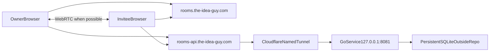

# Handoff: Deploy the Local-First Room Demo for a Public Pilot

**Date:** 2026-07-12
**Repository:** `tid`
**Branch to start from:** `main`
**Primary goal:** Make the stabilized Roomworks demo reachable over HTTPS so it
can be tested between real devices and networks.

## Mission

Deploy the existing local-first room demo using:

- Frontend: `https://rooms.the-idea-guy.com`
- Signaling/mailbox API: `https://rooms-api.the-idea-guy.com`
- Frontend hosting: a new Cloudflare Pages project
- API hosting for this first pilot: a named Cloudflare Tunnel to the Go service
  running on Gil's Mac
- API persistence: SQLite outside the repository

This is a pilot deployment, not the final always-on architecture. The Mac must
remain powered on, awake, online, and running both the Go service and
`cloudflared`.

## Important Architecture Correction

Cloudflare Tunnel exposes the HTTPS signaling/mailbox API. It does **not** relay
the WebRTC DataChannel and it is not TURN.

The deployed behavior should be:

1. Browsers use the public API for admission, encrypted checkpoint bootstrap,
   addressed signaling, and encrypted operation-mailbox fallback.
2. Browsers attempt direct WebRTC using the existing STUN configuration.
3. If direct WebRTC succeeds, the UI reports `Live peer channel`.
4. If NAT traversal fails, encrypted mailbox sync must still work.
5. Record cross-network P2P success/failure. Add TURN as the next reliability
   milestone if real networks frequently fail.

Do not report the pilot as TURN-backed or always-on.

## Current Working System

The implementation was stabilized and verified in commit `524a433`.

### Frontend

`meta-app/` is a React/Vite application on local port 5200:

- `/` lists and creates rooms.
- `/rooms/:roomId` keeps the room on the same host.
- `/join/:inviteId` handles public invitation locators.
- IndexedDB is the canonical local vault.
- AES-GCM encrypts room checkpoints, operations, and signaling envelopes.
- Generated room code runs in a sandboxed iframe with a narrow validated bridge.
- The private `roompkg1` invitation package is shared separately from the
  public URL.
- The room data key never reaches the signaling/mailbox API.

### API

`signaling/` is a Go + SQLite service on local port 8081:

- Durable rooms and unique-member capacity.
- Hashed owner/member/invite credentials.
- One-time expiring and revocable invites.
- Idempotent reconnects.
- Room-scoped device discovery.
- Session-scoped addressed signaling.
- Opaque encrypted room checkpoint and per-device operation mailboxes.
- TTL, record-count, and payload-size limits.
- Prototype `/admin`, `/dev/*`, `/register`, `/get`, and `/room/*` routes are
  disabled.

### Existing Verification

These passed before this handoff:

```sh
cd signaling
go test ./... -count=1
go test -race ./...

cd ../meta-app
npm test
npm run lint
npm run build
npm run test:e2e
```

The E2E test proved offline first join, wrong-invite rejection, idempotent
reconnect, unique-member capacity, mailbox convergence, live local P2P, and
concurrent counter convergence in isolated browser contexts.

## Target Topology



## Pre-Exposure Blocker: Room-Creation Abuse

`POST /v2/rooms` is currently public and unauthenticated. Payload quotas protect
individual records, but an attacker could create unlimited rooms and grow the
SQLite database.

Before exposing the API, implement a pilot creator gate:

- Add an environment-backed pilot creation token to the Go service.
- Require it only for `POST /v2/rooms`, for example through
  `X-Pilot-Create-Token`.
- Store only a constant-time-comparable hash or derive the comparison safely.
- Never commit the token.
- Add a small creator-unlock step to the frontend. The pilot creator pastes the
  token locally before creating rooms.
- Do not place the token in Vite build variables, JavaScript bundles, URLs, or
  checked-in configuration.
- Invitation redemption and admitted-member endpoints remain publicly
  reachable and capability-protected.
- Add Go and frontend tests for missing, invalid, and valid creator tokens.

Also apply Cloudflare rate limits to public API paths. At minimum, limit room
creation, invite redemption attempts, and unusually high signaling/mailbox
request rates by source IP. Do not rely on CORS as an authorization mechanism.

## Implementation Work

### 1. Add Production-Safe Runtime Configuration

The Go process should run with settings equivalent to:

```sh
SIGNALING_ADDR=127.0.0.1:8081
SIGNALING_DB_PATH="/absolute/path/outside/repo/roomworks-signaling.db"
SIGNALING_ALLOWED_ORIGINS="https://rooms.the-idea-guy.com,http://localhost:5200"
ROOMWORKS_PILOT_CREATE_TOKEN="<secret supplied outside git>"
```

Requirements:

- Bind only to `127.0.0.1`; do not expose port 8081 on the LAN or router.
- Put the database outside the repository with restrictive permissions.
- Add a repeatable SQLite backup command or script.
- Ensure logs never include capabilities, invite secrets, authorization
  headers, private invitation packages, encrypted envelopes, or request bodies.
- Add request IDs and minimal status/duration logs if needed for pilot
  diagnosis.
- Keep `/healthz` public and content-free.

### 2. Add a Dedicated Roomworks Pages Deployment

The repository already deploys the main site through:

- `deploy/cloudflare.json`
- `scripts/deploy-cloudflare.sh`

Do **not** repoint or overwrite that existing `tid`/apex deployment.

Create separate Roomworks deployment configuration, using a distinct Pages
project such as `roomworks`, with:

- Build directory: `meta-app`
- Build command: `npm ci && npm run build`
- Output directory: `meta-app/dist`
- Build environment:
  `VITE_SIGNALING_URL=https://rooms-api.the-idea-guy.com`
- Custom domain: `rooms.the-idea-guy.com`

Either safely generalize the current script to accept an explicit config file,
or add a dedicated Roomworks deployment script. A dry-run mode is required.

Add Cloudflare Pages static files:

- `meta-app/public/_redirects` containing `/* /index.html 200` so direct
  `/join/:inviteId` and `/rooms/:roomId` requests load the SPA.
- Appropriate `_headers` for `nosniff`, referrer policy, framing policy, and a
  parent-app CSP that still permits the production API and required WebRTC
  behavior.

Do not weaken the generated iframe's existing `connect-src 'none'` policy.

### 3. Create a Named Cloudflare Tunnel

Use a named tunnel, not a temporary `trycloudflare.com` URL.

Expected operator flow:

```sh
cloudflared tunnel login
cloudflared tunnel create roomworks-signaling
cloudflared tunnel route dns roomworks-signaling rooms-api.the-idea-guy.com
```

The local tunnel configuration should be equivalent to:

```yaml
tunnel: <tunnel-id>
credentials-file: <absolute-path-to-cloudflare-tunnel-json>

ingress:
  - hostname: rooms-api.the-idea-guy.com
    service: http://127.0.0.1:8081
  - service: http_status:404
```

Guardrails:

- Never commit the tunnel ID if the chosen policy treats it as private.
- Never commit the tunnel credentials JSON, Cloudflare API token, account ID,
  pilot creator token, or generated `.env`.
- Do not print credentials into chat or terminal summaries.
- Run `cloudflared` under a supervised macOS service so it restarts after
  failure.
- Run the Go service under `launchd` or an equivalent supervisor.
- Document how to start, stop, inspect, and uninstall both services.

Templates with placeholders may be committed under a dedicated deployment
folder. Installed files containing real paths or credentials stay outside git.

### 4. Configure DNS, TLS, CORS, and Cloudflare Controls

Confirm:

- `rooms.the-idea-guy.com` points to the new Pages project.
- `rooms-api.the-idea-guy.com` points to the named tunnel.
- Both hosts have valid Cloudflare TLS certificates.
- API preflight requests permit only the production frontend and explicit local
  development origins.
- An unrelated origin is rejected.
- The API does not need inbound router port-forwarding.
- Cloudflare WAF/rate-limit controls do not log or expose request bodies.

Do not place Cloudflare Access in front of the whole API unless the browser
credential/CORS flow is explicitly redesigned and tested. Invitees need public
access to capability-protected redemption, checkpoint, mailbox, and signaling
endpoints.

### 5. Persistence and Recovery

Use a stable database location outside the repository. Document:

- Exact runtime path.
- File ownership and permissions.
- Backup command using SQLite's backup mechanism.
- Restore procedure.
- Retention for pilot backups.
- Behavior when the Mac sleeps or loses connectivity.

Test that:

- Restarting the Go process preserves rooms and admitted members.
- Restarting `cloudflared` restores the public API without changing URLs.
- No database, backup, credentials, or runtime logs appear in `git status`.

### 6. Production-Like Test Matrix

Run local tests first. Then, with explicit approval before creating production
test records, test:

1. Desktop owner on home Wi-Fi creates a two-member room.
2. Phone invitee on cellular data opens the public link and pastes the private
   package.
3. Owner browser is closed during first join; encrypted checkpoint bootstrap
   still succeeds.
4. Both devices reopen and converge through the mailbox.
5. Both devices online attempt direct WebRTC.
6. Record whether both UIs reach `Live peer channel`.
7. Make concurrent increments and confirm convergence.
8. Switch one device between Wi-Fi and cellular, then confirm recovery.
9. Reopen the admitted invitee; member count stays at two.
10. A third unique invite is rejected.
11. Restart the tunnel and Go process, then confirm room persistence.
12. Direct navigation to a real `/join/:inviteId` URL returns the Pages app,
    not a 404.
13. `/admin` and all retired prototype/dev endpoints return 404.

Separate the results:

- Admission/mailbox success.
- Direct P2P success.
- P2P failure with successful mailbox fallback.

Do not classify a STUN-only P2P failure as a tunnel failure.

## TURN Decision After the Pilot

After collecting results across home Wi-Fi, cellular, and at least one different
home/office network:

- If direct P2P is consistently reliable, keep TURN as the next hardening task.
- If direct P2P commonly fails, add authenticated TURN before broader testing.
- Evaluate managed TURN versus a small `coturn` deployment.
- Bind TURN credentials to short-lived room/device sessions.
- Keep mailbox fallback regardless; TURN and asynchronous delivery solve
  different problems.

## Expected Repository Changes

Likely files include:

- `signaling/` configuration, creator-gate implementation, and tests
- `meta-app/` creator-unlock UI, API integration, tests, `_redirects`, and
  `_headers`
- A new Roomworks-specific Cloudflare deployment config
- A new Roomworks-specific deployment script or safe config-selection support
- Placeholder-only tunnel/service templates
- A new entry in `docs_and_changelog/`
- Updates to the relevant deployment/run documentation

Follow the repository rule that feature and deployment documentation belongs in
`docs_and_changelog/`.

## Do Not

- Do not expose local port 8081 directly to the internet.
- Do not expose the main TID factory/admin UI.
- Do not modify the existing apex `the-idea-guy.com` deployment unintentionally.
- Do not commit `.env`, SQLite files, tunnel credentials, API tokens, pilot
  tokens, backups, logs, `dist/`, or `node_modules/`.
- Do not embed the pilot creator token in the frontend bundle.
- Do not remove E2EE because the tunnel uses HTTPS.
- Do not claim the signaling server can prevent an admitted peer from copying
  room data.
- Do not claim Cloudflare Tunnel provides TURN.
- Do not run production-mutating E2E tests without explicit approval.

## Definition of Done

- `https://rooms.the-idea-guy.com` serves the Roomworks app.
- Direct `/join/:inviteId` routes work on a clean browser.
- `https://rooms-api.the-idea-guy.com/healthz` returns healthy over the named
  tunnel.
- The API listens only on localhost.
- The frontend uses the production API URL.
- Production CORS allows the intended frontend and rejects unrelated origins.
- Room creation requires the private pilot creator token.
- Cloudflare rate controls are active.
- SQLite persists outside the repository and has a tested backup/restore path.
- Go, frontend, lint, build, and local E2E tests pass.
- The production cross-network test matrix is documented with P2P and mailbox
  outcomes reported separately.
- Both local services are supervised and recover after process failure.
- No secrets or runtime data are committed.
- Rollback instructions are documented and tested.

## Information to Request From Gil Only When Needed

Ask for these through normal secure/operator flows rather than chat whenever
possible:

- Confirmation that the `the-idea-guy.com` zone is active in the intended
  Cloudflare account.
- Cloudflare login/authorization when CLI tools prompt.
- API token/account permissions if automation cannot use interactive login.
- The pilot creator token, entered locally and never printed.
- Approval before creating production test rooms or changing DNS.

## Rollback

The handoff is incomplete without a rollback procedure:

1. Stop the named tunnel to make the API unreachable.
2. Roll Pages back to its previous deployment or detach the Roomworks domain.
3. Remove only the Roomworks DNS/tunnel route; do not touch the apex site.
4. Preserve the SQLite database and backup for diagnosis.
5. Restore the previous supervised service definitions if runtime changes fail.

The first rollback priority is protecting data and credentials, not preserving
pilot uptime.
